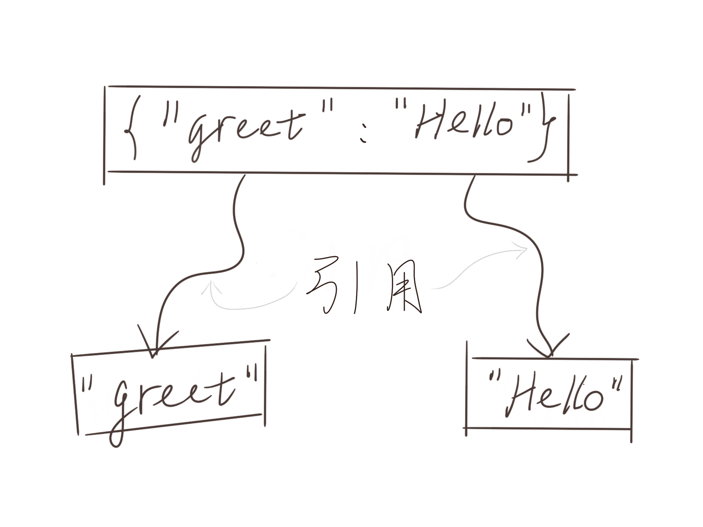
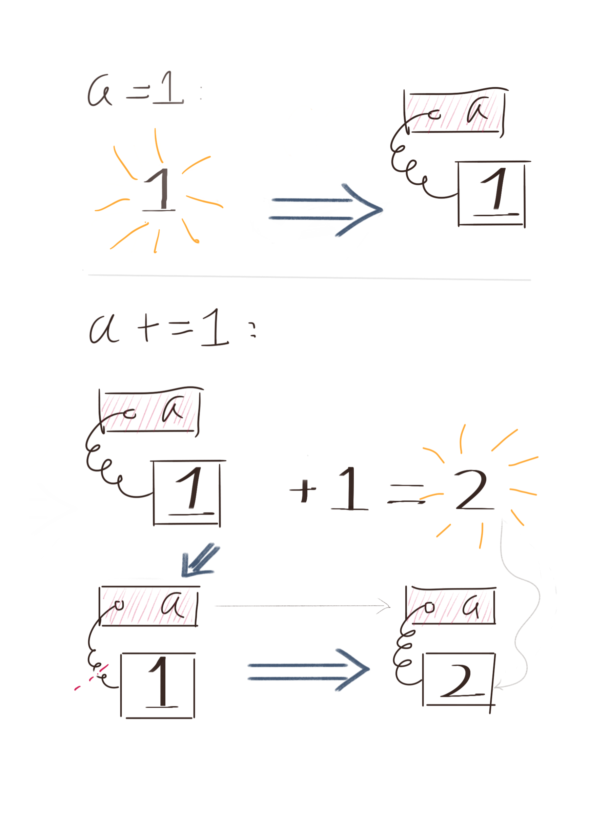
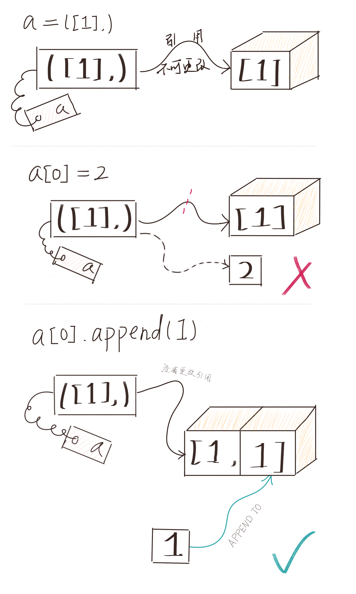

# 数据模型

数据抽象是高级语言的一个重大进步。数据只是内存中杂乱的 01 序列，但人类习惯于处理语义化、结构化的信息。如果没有强大的工具辅助，即使最简单的 HelloWorld 也会让我们难以下手。编程语言需要一种机制以有效区分不同的数据区域，同时约束代码对数据的操作。我们通常把这些关于「如何解读/操纵数据」的机制称为 **数据模型（Data Model）**。

为什么需要用单独的一节讨论数据模型呢？作为一门不算太年轻的面向对象动态语言，Python 中的诸多概念如「变量」、「对象」、「类型」等，我们都可以在其他语言中找到对应项。但事实上，这并不能帮助我们理解其在 Python 中的含义。不同语言会用相同的术语描述看上去相似的概念，但由于语言类型（静态或动态）、主范式（函数式、面向对象等）等的区别，其真实含义也许会大相径庭。如果生搬硬套其他语言的同名概念，很有可能会适得其反——如用 C++ 中的「变量」来理解 Python 中的「变量」，我们将在下文看到这一点。而另一方面，数据模型又是编程语言中极为基础而重要的一部分，若不能清晰地掌握这一内容，我们容易犯一些致命但又不明显的错误。因此，这一话题需要详细讨论。

我们从「对象」开始说起。

## 万物皆为对象的 Python

这是一句完美概括 Python 数据模型的表述——你应该在许多场合都听说过，但未必能完全理解其含义。事实上，当我们这么说时，实际想传达的是如下两个隐喻：

 + Python 语言中的实体，包括数字、字符、函数、类实例甚至类型本身等，都有着相似的构造。它们可以拥有**属性（Properties）**和**方法（Methods）**，也可以和其他的实体建立联系。这一点在别的语言中不一定成立，如 Java 有 原生数据类型（Primitive Type）和 引用数据类型（Reference Type）之分，只有后者的实例能拥有属性和方法，并与前者建立联系。
 + 从语法层面看，程序可以使用一致的方式访问 Python 中的任何实体。我们可以使用 `.` 运算符访问任何对象的属性或方法，也可以通过 `a.b = c` 的方式改变对象的属性（在允许的情况下）。这一条对字面量也是成立的，因此我们可以写出看上去有些奇怪的代码 `0xdeadbeef.__str__()`。

这种设计可以为编程带来诸多便利，也为一些新范式的实现带来了可能。一个例子是「鸭子类型」（Duck-Typing），即被调用者只需要求参数有特定的属性，而不必顾虑参数的类型——其实现基础是程序可以自由而统一地访问所有对象的属性。这样一来，我们可以选择更为灵活的方式做设计，如将复杂的装饰器写成一个有 `__call__` 方法的类，以降低系统的复杂度。

> 当然另一方面，这种设计也有其缺点，即让对象变得臃肿。每个对象都要占据额外的空间以存储辅助信息（类型、方法表等）。我们可以使用 `sys.getsizeof` 获得对象所占的字节数：
> 
> ```python
> >>> import sys; sys.getsizeof(1)
> 28
> ```
> 从这可以看出，在 Python 中整型对象 `1` 占用了 28 字节，这已经远远超出 C/C++ 中整型变量的大小（4 或 8 字节）。但大多数情况下我们感受不到其中的差异，因此可以不必担心这个问题。

对象往往不是孤立的，而是会和其他的对象产生关联，这种关联被称为引用（References）。引用有很多种形式。容器对象如 `[]` 或 `set()` 会对自己包含的对象产生引用；普通对象会对自己各属性的值产生引用。对象及对象间的引用即构成了 Python 中的数据。

每个对象都有两个最基本的要素：标识符（Identifier）、类型（Type）和值（Value）。

## 标识符

对象的标识符是一个整数，在物理内存占据不同位置的对象会有不同的标识符，反之亦然。从这点上看，标识符与内存地址有些相似之处。事实上，在 CPython 中，对象的标识符就是对象的内存地址。但这一条并不是语言标准，在其他实现中可能不成立。

我们可以使用 `id(x)` 获得对象 `x` 的标识符。Python 还提供了 `is` 和 `is not` 两个运算符，用于比较两个对象的标识符是否一致。确切说，`x is y` 与 `id(x) == id(y)` 是等价的，`is not` 同理。

通常来说我们很少会直接比较对象的标识符，这种用法多见于单例模式的类型。一个例子是判断对象是否为 `None`，由于 `NoneType` 全局只有 `None` 一个实例，我们更倾向于采用 `x is None` 的写法。

> 下面这段代码的结果可能会让你对标识符的定义产生疑惑：
>
> ```python
> id1 = id([1])
> id2 = id([2])
> print(id1, id2, id1 == id2)
> # Output: 139924933463112 139924933463112 True
> ```
>
> 尽管 `[1]` 和 `[2]` 是两个完全不同的对象，以上结果是有可能出现的。这个现象与 GC（Garbage Collector，垃圾回收器）的行为有关。`[1]` 是一个无引用对象，在第一句执行完后会被 GC 销毁回收，此时若 `[2]` 被创建在 `[1]` 曾经存在的地方，两个对象就会拥有同样的标识符。换句话说，两个对象只是先后占据了同一个物理地址。

## 类型

Python 的主范式是面向对象编程，而且是基于类的面向对象，这意味着每个对象都是某个类的实例，这个类同时也就是该对象的类型。对象的类型储存在一个特殊属性 `__class__` 中，我们可以使用 `type()` 函数获取它：

```python
(1.0).__class__  # <class 'float'>
type(1.0)        # <class 'float'>

# 下面这条总是为 True
type(x) is x.__class__
```

一个对象的类型总是唯一的，并且通常来说是不可更改的。因此，我们可以认为类型是对象的固有属性。

> 这里说的「不可更改」其实是一种约定。事实上，对象只经由 `__class__` 属性与其类型发生唯一的关联，而在 Python 中，如无特殊限制，属性总是能被更改的。下面这段代码是完全可以运行的：
>
> ```python
> class A: pass
> class B: pass
> a = A()
> a.__class__ = B
> type(a)  # <__main__.B object at 0x7f450f65fb70>
> ```
>
> 但以上操作只会给依赖这一特性的调用者徒增麻烦，是被强烈反对的。类似的约定会在后续章节中多次出现。

前面谈到：Python 中万物皆为对象。那类型是否也有类型呢？答案是肯定的：

```python
>>> type(int)
<type 'type'>
>>> type(str)
<type 'type'>
>>> type(type)
<type 'type'>
```

可以看出：`type` 其实也是一个类型，Python 中各类型总是 `type` 或 `type` 的子类的实例（反过来也是对的，即 `type` 或其子类的实例总是一种类型）。特别地，`type` 是自己的类型。初看这一点可能会比较奇怪，但如果仅仅把类型当做对象身上的一个属性的话，就比较好理解了——`type` 只是有一个指向了自己的属性。

我们不妨给类型下一个形式上的定义：如果一个对象 `x` 是 `type` 或其子类的实例，并且支持通过 `x(...)` 这样的调用产生一个 `__class__` 为 `x` 的新对象，则 `x` 为一个类型。这个定义或许能帮助你更加清晰地认识这一概念。

类型约束着对象的行为。若想让对象支持某一操作（或能对它执行某种操作），对象的类型必须实现了相应的方法，比如实现了 `__len__` 方法的类型，其实例才支持 `len(x)` 这样的调用；又如实现了 `read`、`write`、`seek` 等方法的对象（通常称为 File-like Objects，即类文件对象），我们可以使用它进行数据读写的操作。行为不仅仅指显式的函数调用，也包括一些隐式的东西，如是否允许实例化时复用已存在的对象。在讨论对象可变性时我们会进一步研究这一问题。

## 值

值其实不是一个技术上的概念，并且其指向与语境有关。简单来说，值就是对象中我们所关心的部分，可能是对象的某些属性，可能是和其他对象的引用关系，或者是对象本身。

大部分的内置简单对象都有一个内禀的值，如整型对象 `123` 其实是数 123 的包装器；字符串对象 `"Hello world!"`，其内部某处也有着这么一个字符数组。在谈论这些对象的「值」时，我们指的是其内禀的值。

Python 中还有一类内置对象称为容器对象（Containers），它们没有内禀的值，而是保持着和其他对象的引用关系，形成各种数据结构（线性表、哈希表）。如字典对象 `{ "greet": "Hello" }` 持有对两个字符串对象的引用。某种意义上讲，它们内禀的值就是其内部的若干引用。但在谈论业务逻辑相关内容时，引用不是我们所关心的，此时「值」指的是被引用对象的值。而在进行技术性讨论时，我们更侧重于关注引用本身，此时的「值」指的是引用。



对于更广泛的对象，如许多自定义类型的实例，它们通常会经由属性引用其他的对象。在这种情况下，对象的「值」指的是和业务相关的属性的值。

## 可变性

在创建对象时，我们总会显式或隐式地为其提供一个初始值。被创建后，大部分对象的值仍能被修改，但有一些却不行。这就引出了可变性（Mutability）的概念。

值不可修改的对象称为不可变对象（Immutables）。常见的不可变类型有如下几种：

 1. `int`
 2. `float`
 3. `decimal.Decimal`
 4. `complex`
 5. `bool`
 6. `str`
 7. `bytes`
 8. `range`
 9. `fronzenset`
 10. `tuple`

不可变类型屏蔽了所有的原地操作（In-place Operations），使我们无法改变其实例内部的值：

```python
>>> s = "abc"
>>> s[0] = "c"
Traceback (most recent call last):
  File "<stdin>", line 1, in <module>
TypeError: 'str' object does not support item assignment
>>> t = (1, "abc")
>>> del t[1]
Traceback (most recent call last):
  File "<stdin>", line 1, in <module>
TypeError: 'tuple' object doesn't support item deletion
``` 

看到这里也许你会感到奇怪：如果数字类型都是不可变的，又怎么能进行数学运算呢？再者，下面这段代码能够正常运行，又该如何解释呢？

```python
>>> a = 1
>>> a += 1
>>> print(a)
2
```

以上操作，不正是将对象 `a` 的值从 `1` 变成了 `2` 吗？

这是一个常见的误区，即认为**变量是对象本身**。在许多编译型语言中，变量始终占据着固定的物理地址，对变量的修改即意味着对该处内容的修改。但在 Python 中，**占据固定的内存地址的是对象，而不是变量**。变量是类似于标签的存在，在赋值时（严格来说，是在名称绑定时），指向特定的对象。这种指向关系可以随时解绑或重新绑定。我们可以使用 `id()` 函数观察到指向的变化：

```python
>>> a = 1
>>> id(a)
9297344
>>> a += 1
>>> id(a)
9297376
>>> a
2
```

可以发现在运算前后，`a` 的标识符发生了变化，因为 `a` 的指向从 `1` 变成了 `2`，而这是两个不同的对象。事实上，在解释其内部执行的是如下的操作：



`id()` 是一个能很好检验对象一致性的工具。当运行结果使你感到迷惑时，不妨使用 `id()` 检查相关对象的标识符。

关于不可变对象还有一个常见的误区。先看一个例子：

```python
>>> a = ([1],)
>>> a[0].append(1)
>>> a
>>> ([1, 1],)
```

既然 `tuple` 是不可变类型，此处又为何能改变它的值呢？

上文提到：引用是容器对象的内禀值。因此在谈论它们的不可变性时，我们指的是**引用不可变**。至于被引用的对象，改变它们的值是允许的。具体到上面的例子中，`a` 第一个位置引用了一个列表 `[1]`，是一个可变对象。`a[0].append(1)` 实际是对列表进行了操作，而没有修改引用关系，因此是被允许的。



除了值不可更改，不可变类型和可变类型还有一个重要的区别，即允许在创建实例时复用已存在的对象。观察下面这个例子：

```python
>>> a = 1
>>> b = 1
>>> a is b
True
>>> a = ()
>>> b = ()
>>> a is b
True
```

对于小型不可变对象（较小的数字、空元组等），Python 会对它们进行缓存，以便未来复用。对象的不可变性保证了不会出现数据竞态，因此是安全的。这种做法可以有效节约内存。但需要注意的是，对象复用不是语言特性，而是取决于解释器的具体实现。相同的代码也许在 CPython 上能运行，到了其他发行版却不能。故在实际生产中，我们不能依赖这一特性。

不可变对象在保护数据安全方面有着不可忽视的作用。不可变性保证了对象不会被意外写入，从而可以放心地将其交给不受信任的函数。因此在无写入需求时，应该尽量使用 `tuple` 或 `frozenset` 等来储存数据。

## 赋值语义与参数传递语义

赋值是一种常见的操作，但不同的编程语言会对这一操作有不同的解释。这就是所谓的赋值语义（Assignment Semantics）。Rust 使用的是移动语义（Move Semantics），赋值后右值的指向会传递给左值；大多数静态语言使用值拷贝语义（Copy Semantics），赋值时会将右值的内容拷贝给左值；Python 和许多动态语言一样，使用的是引用共享语义（Share Semantics），即在赋值时会增加一个从左值到右值的引用。

```python
>>> a = [1]
>>> b = a
>>> print(id(a), id(b))
140493368438088 140493368438088
>>> a.append(2)
>>> a
[1, 2]
>>> b
[1, 2]
```

上面的例子中，`a` 先是指向了对象 `[1]`。执行 `b = a` 后，`b` 也指向了同一个对象。因此 `a` 和 `b` 拥有同样的标识符，经由 `a` 进行的操作也会在 `b` 上反应出来。

和单重赋值相同，多重赋值会让所有左值指向右值：

```python
>>> c = d = [1]
>>> print(id(c), id(d))
140493390032072 140493390032072
```

值得注意的是，Python 的赋值是语句而不是表达式（关于二者的差别可以参考第三节）——这点和 C++ 或 JavaScript 不同。换句话说，`a + (b = 1)` 这样的表达式是不允许的，因为赋值没有返回值。同时 `a = b = 1` 不等价于 `a = (b = 1)`，多重复值只是一个多目的语句。

另一个需要探讨的话题是参数传递语义。这一点和赋值类似，即会增加一个从参数名到被传递对象的引用：

```python
def print_id(x):
    print("print from callee:", id(x))

lst = []
print("print from caller:", id(lst))
print_id(lst)

# print from caller: 140493368454472
# print from callee: 140493368454472
```

因此如果被传递对象是一个可变对象，在函数内部对其的改变也会在外部反映出来。但如果在函数内对参数名重新绑定，在外部则不会有任何影响：

```python
def f(x):
    x = [1, 2]

lst = [1]
f(lst)
print(lst) # [1]
```

这种只增加对象引用而不拷贝对象的行为在 Python 中很常见，并且有许多都是隐式发生的。下面是一个经典的例子：

```python
>>> a = [[]]
>>> a = a * 4
>>> a
[[], [], [], []]
>>> a.append(1)
[[1], [1], [1], [1]]
```

`a * 4` 并没有将 `a` 内部的空列表 `[]` 拷贝 4 次，而只是增加了 3 个指向它的新引用，因此在后续的更改会在 4 个元素上都表现出来。这一点需要格外小心。

## 小结

Python 中一切都是对象，数据被表示为对象与对象间的引用。

对象有标识符、类型和值。标识符和对象是一一对应关系，类型决定了对象的行为，对象的值有可变与不可变之分。

对象占据固定的内存空间，变量则不是。

Python 使用共享引用赋值语义和类似的参数传递规则。只增加对象引用而不拷贝对象在 Python 中很常见。